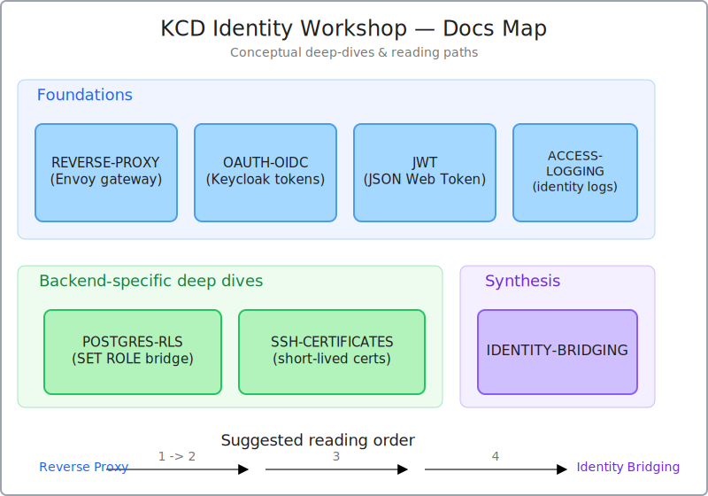

# Documentation

Conceptual deep-dives on the technologies and patterns used in this workshop. Each file is standalone; cross-references between them are explicit.

The hands-on side of the workshop lives in [`../follow-along/`](../follow-along/). These docs are for *understanding*; the follow-along is for *running*.

## Foundations

These cover the building blocks every backend in the demo relies on.

### [Reverse Proxy Architecture](REVERSE-PROXY.md)
How reverse proxies work, what role Envoy plays as a security gateway, and why this beats VPN-style network-level trust. Walks through Envoy's filter chain, the JWT authentication filter, the RBAC authorization filter, and request routing.

**Topics:** Envoy filter chain · JWT authentication filter · RBAC authorization filter · network topology and isolation · VPN vs reverse proxy comparison · zero trust principles.

### [OAuth2 and OpenID Connect](OAUTH-OIDC.md)
Comprehensive guide to OAuth2 and OIDC — how they work, how they relate, and how this demo uses both. The protocol layer underneath everything else.

**Topics:** OAuth2 vs OIDC relationship · grant types (password grant in demo) · token endpoint and flow · OIDC discovery and standard claims · production-ready Authorization Code Flow · security considerations.

### [JWT Tokens](JWT-JSON-WEB-TOKEN.md)
Deep dive on JSON Web Tokens — structure, signing, validation, and the security guarantees they provide.

**Topics:** JWT structure (Header.Payload.Signature) · base64url encoding · RS256 signature algorithm · claims · JWKS · token validation process · integrity / authenticity / statelessness.

### [Access Logging with Identity](ACCESS-LOGGING.md)
How Envoy's dynamic metadata system enables identity-aware logs, and what a complete audit trail looks like for compliance and security monitoring.

**Topics:** dynamic metadata in Envoy · data flow between filters · access log format · log fields and sources · audit trail analysis · security monitoring use cases.

## Backend-specific deep dives

These cover the per-backend integration patterns the workshop's four parts demonstrate.

### [Postgres Row-Level Security](POSTGRES-RLS.md)
How the demo bridges a Keycloak JWT into Postgres without Postgres ever needing to understand JWTs. Pairs with `follow-along/04-postgres-rls.md`.

**Topics:** roles and role membership · `NOINHERIT` and least-privilege login users · `SET ROLE` vs `SET LOCAL ROLE` · RLS policies and `current_user` · `FORCE ROW LEVEL SECURITY` · cross-tenant scaling strategies.

### [SSH Certificate Authentication](SSH-CERTIFICATES.md)
How short-lived CA-signed SSH user certificates replace long-lived `authorized_keys`, and why principals beat keys for cross-user denial. Pairs with `follow-along/03-ssh-certs.md`.

**Topics:** anatomy of an SSH cert · `TrustedUserCAKeys` · `AuthorizedPrincipalsFile` · `AuthorizedKeysFile=none` · short validity vs revocation lists · CA key rotation · host certs, ProxyJump, multi-tenancy.

## Synthesis

### [Identity Bridging: One Login, Many Systems](IDENTITY-BRIDGING.md)
The meta-pattern that ties the workshop together. Every backend follows the same shape (federated identity at the edge → short-lived protocol-native credential at the resource); only the bridge differs. Generalizes to AWS STS, kubectl OIDC, Vault, GitHub Actions OIDC, mTLS, etc.

**Topics:** the shape of every integration · why one IdP isn't enough · the four patterns in this demo (bearer-token gateway, identity bridge, native OIDC, signed-credential CA) · pattern map across the broader ecosystem · choosing a pattern for a new backend · anti-patterns · production hardening checklist.

## Suggested reading order

**Path 1 — workshop preparation:**
1. [REVERSE-PROXY.md](REVERSE-PROXY.md) — what Envoy does
2. [OAUTH-OIDC.md](OAUTH-OIDC.md) — how Keycloak issues tokens
3. [JWT-JSON-WEB-TOKEN.md](JWT-JSON-WEB-TOKEN.md) — what's in those tokens
4. [POSTGRES-RLS.md](POSTGRES-RLS.md) and [SSH-CERTIFICATES.md](SSH-CERTIFICATES.md) — the per-backend integrations
5. [IDENTITY-BRIDGING.md](IDENTITY-BRIDGING.md) — the synthesis

**Path 2 — by interest:**
- "I want to understand the demo" → [Main README](../README.md)
- "I want to run the demo" → [`../follow-along/`](../follow-along/)
- "I want to understand a specific backend" → that backend's deep-dive doc above
- "I want to apply this pattern elsewhere" → [IDENTITY-BRIDGING.md](IDENTITY-BRIDGING.md)

## Related

- [Main README](../README.md) — architecture overview, what each component is
- [Follow-Along Workshop](../follow-along/README.md) — hands-on, one module per backend
