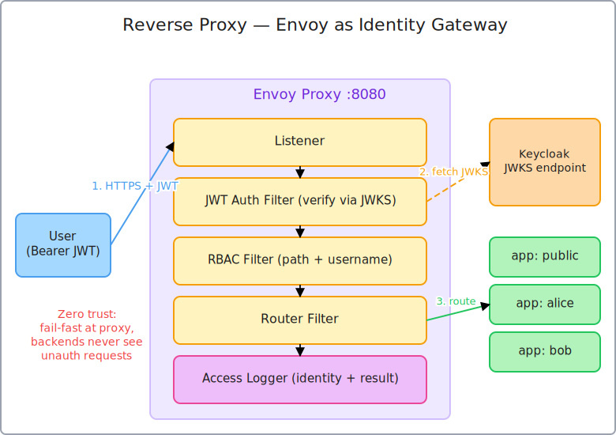

# Reverse Proxy Architecture Explained

This document explains how reverse proxies work in our demo, why they provide better security than traditional VPN-based approaches, and how Envoy implements identity-aware access control.



## Table of Contents

1. [What is a Reverse Proxy?](#what-is-a-reverse-proxy)
2. [Forward Proxy vs Reverse Proxy](#forward-proxy-vs-reverse-proxy)
3. [How Envoy Works as a Reverse Proxy](#how-envoy-works-as-a-reverse-proxy)
4. [Security Benefits](#security-benefits)
5. [VPN vs Reverse Proxy Comparison](#vpn-vs-reverse-proxy-comparison)
6. [Architecture in Our Demo](#architecture-in-our-demo)
7. [Request Flow](#request-flow)
8. [Security Enforcement Layers](#security-enforcement-layers)
9. [Why This is Better Than VPN](#why-this-is-better-than-vpn)
10. [Production Considerations](#production-considerations)

---

## What is a Reverse Proxy?

A **reverse proxy** is a server that sits in front of backend services and forwards client requests to them. Unlike a forward proxy (which sits in front of clients), a reverse proxy sits in front of servers.

### The Analogy

**Reverse Proxy = Security Guard at Building Entrance**

```
┌─────────────────────────────────────────────┐
│         Traditional Direct Access           │
│                                             │
│  User → App Server 1                        │
│  User → App Server 2                        │
│  User → App Server 3                        │
│                                             │
│  Problem: Users connect directly            │
│  Each app must implement security           │
└─────────────────────────────────────────────┘

┌─────────────────────────────────────────────┐
│        Reverse Proxy Architecture           │
│                                             │
│  User → [Reverse Proxy] → App Server 1      │
│                         → App Server 2      │
│                         → App Server 3      │
│                                             │
│  Benefit: Single entry point                │
│  Centralized security enforcement           │
└─────────────────────────────────────────────┘
```

Just like a security guard:
- ✅ Checks ID before letting anyone in (authentication)
- ✅ Verifies you're allowed in specific rooms (authorization)
- ✅ Logs who went where and when (audit trail)
- ✅ Can deny access without bothering the app (fail-fast)

### Key Characteristics

**Single Entry Point**
- All traffic flows through one component
- Easier to secure (one point of control)
- Consistent policy enforcement

**Request Routing**
- Directs requests to appropriate backend services
- Load balancing across multiple instances
- Health checking and failover

**Security Enforcement**
- Authentication before reaching apps
- Authorization at the proxy layer
- Backend services trust the proxy

**Protocol Translation**
- HTTPS termination (TLS/SSL)
- HTTP/2 or HTTP/3 to HTTP/1.1
- WebSocket support

---

## Forward Proxy vs Reverse Proxy

Understanding the difference is crucial:

### Forward Proxy (Traditional Proxy)

```
┌──────┐     ┌─────────────┐     ┌────────┐
│ User │────▶│Forward Proxy│────▶│Internet│
└──────┘     └─────────────┘     └────────┘
             ↑
             Hides/protects CLIENT
```

**Purpose**: Protect/control client access to internet
**Examples**: Corporate proxies, content filters, anonymizers
**Who uses**: Clients (users/organizations)
**Direction**: Client → Proxy → Many Servers

### Reverse Proxy (Our Demo)

```
┌──────┐     ┌──────────────┐     ┌──────────┐
│ User │────▶│Reverse Proxy │────▶│ Backend  │
└──────┘     └──────────────┘     └──────────┘
             ↑
             Hides/protects SERVER
```

**Purpose**: Protect/control access to backend services
**Examples**: Envoy, NGINX, HAProxy, AWS ALB
**Who uses**: Server operators
**Direction**: Many Clients → Proxy → Backends

### Quick Comparison

| Aspect | Forward Proxy | Reverse Proxy |
|--------|--------------|---------------|
| **Protects** | Client | Server |
| **Controlled by** | Client/Organization | Server operator |
| **Hides** | Client IP/identity | Server topology |
| **Use Case** | Internet access control | Backend protection |
| **Example** | Corporate proxy | Load balancer |

---

## How Envoy Works as a Reverse Proxy

Envoy is a modern, high-performance reverse proxy designed for cloud-native applications.

### Envoy's Role in Our Demo

```
┌─────────────────────────────────────────────────────┐
│                    Envoy Proxy                      │
│                  (Port 8080)                        │
│                                                     │
│  ┌──────────────────────────────────────────────┐   │
│  │  Listener (0.0.0.0:8080)                     │   │
│  │  - Accepts all incoming connections          │   │
│  └──────────────────┬───────────────────────────┘   │
│                     │                               │
│                     ▼                               │
│  ┌──────────────────────────────────────────────┐   │
│  │  HTTP Connection Manager                     │   │
│  │  - Manages HTTP/1.1, HTTP/2 connections      │   │
│  └──────────────────┬───────────────────────────┘   │
│                     │                               │
│                     ▼                               │
│  ┌──────────────────────────────────────────────┐   │
│  │  Filter Chain                                │   │
│  │  1. JWT Authentication Filter                │   │
│  │  2. RBAC Authorization Filter                │   │
│  │  3. Router Filter                            │   │
│  └──────────────────┬───────────────────────────┘   │
│                     │                               │
│                     ▼                               │
│  ┌──────────────────────────────────────────────┐   │
│  │  Clusters (Backend Services)                 │   │
│  │  - public-app (port 3000)                    │   │
│  │  - alice-app (port 3002)                     │   │
│  │  - bob-app (port 3001)                       │   │
│  └──────────────────────────────────────────────┘   │
└─────────────────────────────────────────────────────┘
```

### Key Components

#### 1. Listener

```yaml
listeners:
- name: main_listener
  address:
    socket_address:
      address: 0.0.0.0
      port_value: 8080
```

**Purpose**: Entry point for all traffic
- Listens on port 8080
- Accepts connections from any IP (0.0.0.0)
- Hands off to HTTP connection manager

#### 2. Routes

```yaml
routes:
- match:
    prefix: "/public"
  route:
    cluster: public_app_cluster
    prefix_rewrite: "/"

- match:
    prefix: "/alice"
  route:
    cluster: alice_app_cluster
    prefix_rewrite: "/"

- match:
    prefix: "/bob"
  route:
    cluster: bob_app_cluster
    prefix_rewrite: "/"
```

**Purpose**: Map URLs to backend services
- `/public` → public-app service
- `/alice` → alice-app service
- `/bob` → bob-app service

**Path rewriting**: `/alice` becomes `/` when forwarded to alice-app

#### 3. Filters

**HTTP Filters process every request in order**:

```
Request → JWT Filter → RBAC Filter → Router Filter → Backend
```

Each filter can:
- ✅ Allow request to continue
- ❌ Deny request (return error)
- 📝 Modify request/metadata

#### 4. Clusters

```yaml
clusters:
- name: alice_app_cluster
  connect_timeout: 5s
  type: STRICT_DNS
  load_assignment:
    endpoints:
    - lb_endpoints:
      - endpoint:
          address:
            socket_address:
              address: alice-app
              port_value: 3002
```

**Purpose**: Define backend services
- Service name (DNS)
- Port number
- Health check configuration
- Load balancing strategy

---

## Security Benefits

Reverse proxies provide multiple security layers that traditional architectures lack.

### 1. Single Point of Control

**Without Reverse Proxy**:
```
User → App 1 (must implement auth)
User → App 2 (must implement auth)
User → App 3 (must implement auth)

Problem: Each app implements security independently
Risk: Inconsistent security, missed vulnerabilities
```

**With Reverse Proxy**:
```
User → [Envoy checks auth] → App 1 (trusts proxy)
                          → App 2 (trusts proxy)
                          → App 3 (trusts proxy)

Benefit: Security implemented once, consistently
Result: Apps focus on business logic
```

### 2. Defense in Depth

Multiple security layers protect backend services:

```
┌─────────────────────────────────────────┐
│  Layer 1: Network Isolation             │
│  Backend services not directly exposed  │
└───────────────┬─────────────────────────┘
                │
                ▼
┌─────────────────────────────────────────┐
│  Layer 2: TLS Termination (production)  │
│  Decrypt HTTPS, validate certificates   │
└───────────────┬─────────────────────────┘
                │
                ▼
┌─────────────────────────────────────────┐
│  Layer 3: JWT Authentication            │
│  Verify token signature and expiration  │
└───────────────┬─────────────────────────┘
                │
                ▼
┌─────────────────────────────────────────┐
│  Layer 4: RBAC Authorization            │
│  Check user permissions for resource    │
└───────────────┬─────────────────────────┘
                │
                ▼
┌─────────────────────────────────────────┐
│  Layer 5: Rate Limiting (optional)      │
│  Prevent abuse, DDoS protection         │
└───────────────┬─────────────────────────┘
                │
                ▼
           Backend Service
```

**Each layer can independently fail-safe** - if any layer denies access, request never reaches backend.

### 3. Attack Surface Reduction

**Direct Backend Exposure** (Bad):
```
Internet
    ↓
┌───────────────────────────────────┐
│  Backend App                      │
│  - Must handle TLS                │
│  - Must validate auth             │
│  - Must implement authz           │
│  - Must handle rate limiting      │
│  - Must log access                │
│  - Must do business logic         │
│  - Exposed to internet attacks    │
└───────────────────────────────────┘
```

**Reverse Proxy Protection** (Good):
```
Internet
    ↓
┌───────────────────────────────────┐
│  Reverse Proxy (Envoy)            │
│  - Handles TLS                    │
│  - Validates auth                 │
│  - Implements authz               │
│  - Rate limiting                  │
│  - Access logging                 │
│  - ONLY THIS exposed to internet  │
└──────────────┬────────────────────┘
               │ Private Network
               ▼
┌───────────────────────────────────┐
│  Backend App                      │
│  - Business logic only            │
│  - Trusts proxy                   │
│  - Not exposed to internet        │
└───────────────────────────────────┘
```

**Benefits**:
- Smaller attack surface (only proxy exposed)
- Specialized security component (Envoy is battle-tested)
- Apps don't need to be security experts

### 4. Fail-Fast Security

**Request rejected at proxy** (fast, efficient):
```
User → [Envoy: Invalid token] → 401 Unauthorized (5ms)
       Backend never contacted
       No backend resources consumed
```

**Request rejected at backend** (slow, wasteful):
```
User → [No security] → Backend receives request → Backend validates → 401 (50ms)
       Backend resources consumed
       Database queries run
       Processing time wasted
```

**Benefits**:
- Faster error responses
- Reduced backend load
- Better performance under attack
- Lower infrastructure costs

### 5. Centralized Logging and Monitoring

All traffic flows through proxy:

```json
// Every request logged with context
{
  "timestamp": "2024-01-20T10:30:45Z",
  "user": "alice",
  "source_ip": "192.168.1.100",
  "method": "GET",
  "path": "/alice",
  "status": 200,
  "duration_ms": 15,
  "user_agent": "curl/7.64.1"
}
```

**Enables**:
- Complete audit trail
- Security monitoring (detect attacks)
- Analytics (usage patterns)
- Compliance reporting
- Incident response

---

## VPN vs Reverse Proxy Comparison

### Traditional VPN Approach

```
┌──────────────────────────────────────────────┐
│          Corporate Network (VPN)             │
│                                              │
│  User connects to VPN                        │
│  ↓                                           │
│  ┌────────────────────────────────────────┐  │
│  │  User has network-level access to:     │  │
│  │  - All backend services                │  │
│  │  - All databases                       │  │
│  │  - All internal systems                │  │
│  └────────────────────────────────────────┘  │
│                                              │
│  Security Model:                             │
│  - Trust based on network access             │
│  - Coarse-grained (all or nothing)           │
│  - No per-request validation                 │
└──────────────────────────────────────────────┘
```

**Problems**:
- ❌ All-or-nothing access
- ❌ No identity awareness per request
- ❌ Lateral movement possible
- ❌ Limited audit trail (IP addresses only)
- ❌ Can't distinguish Alice from Bob

### Reverse Proxy Approach (Our Demo)

```
┌──────────────────────────────────────────────┐
│      Reverse Proxy (Zero Trust)              │
│                                              │
│  Every request validated                     │
│  ↓                                           │
│  ┌────────────────────────────────────────┐  │
│  │  User identity checked per-request:    │  │
│  │  - Alice → /alice only                 │  │
│  │  - Bob → /bob only                     │  │
│  │  - Both → /public                      │  │
│  └────────────────────────────────────────┘  │
│                                              │
│  Security Model:                             │
│  - Never trust, always verify                │
│  - Fine-grained (per-resource)               │
│  - Every request validated                   │
│  - Complete identity context                 │
└──────────────────────────────────────────────┘
```

**Advantages**:
- ✅ Per-user, per-resource access control
- ✅ Identity-aware (knows Alice vs Bob)
- ✅ Zero lateral movement
- ✅ Complete audit trail
- ✅ Can enforce policy per endpoint

### Side-by-Side Comparison

| Aspect | VPN | Reverse Proxy (Envoy) |
|--------|-----|----------------------|
| **Access Model** | Network-level (IP-based) | Application-level (identity-based) |
| **Granularity** | All or nothing | Per-user, per-resource |
| **Identity** | IP address | User identity (JWT claims) |
| **Per-Request Validation** | No | Yes (every request) |
| **Lateral Movement** | Easy (same network) | Blocked (per-resource authz) |
| **Audit Trail** | Limited (connection logs) | Complete (user + action) |
| **Scalability** | VPN server bottleneck | Stateless, horizontally scalable |
| **Zero Trust** | Implicit trust inside network | Never trust, always verify |
| **Policy Enforcement** | Network-level firewall | Application-aware policies |
| **Logging** | IP, port, bytes | User, resource, action, result |

### Real-World Example

**Scenario**: Alice and Bob are both employees. Alice should access customer data, Bob should access financial data.

**With VPN**:
```
Alice connects to VPN
  → Can reach customer-db server (✓ correct)
  → Can also reach financial-db server (✗ wrong!)
  → Can reach Bob's workspace (✗ wrong!)

Bob connects to VPN
  → Can reach financial-db server (✓ correct)
  → Can also reach customer-db server (✗ wrong!)
  → Can reach Alice's workspace (✗ wrong!)

Problem: Too much access, no per-resource control
```

**With Reverse Proxy** (Our Demo):
```
Alice authenticates (JWT with username="alice")
  → GET /customer-data → 200 OK (✓ allowed)
  → GET /financial-data → 403 Forbidden (✗ blocked)
  → GET /bob → 403 Forbidden (✗ blocked)

Bob authenticates (JWT with username="bob")
  → GET /financial-data → 200 OK (✓ allowed)
  → GET /customer-data → 403 Forbidden (✗ blocked)
  → GET /alice → 403 Forbidden (✗ blocked)

Solution: Least-privilege access, per-resource control
```

---

## Architecture in Our Demo

### Network Topology

```
┌───────────────────────────────────────────────┐
│         Docker Network (demo-network)         │
│                                               │
│  ┌──────────────────────────────────────────┐ │
│  │  Keycloak (keycloak:8180)                │ │
│  │  - Issues JWT tokens                     │ │
│  │  - Provides JWKS for validation          │ │
│  └────────────┬─────────────────────────────┘ │
│               │                               │
│               │ JWKS                          │
│               ▼                               │
│  ┌──────────────────────────────────────────┐ │
│  │  Envoy Proxy (envoy:8080)                │ │
│  │  - Validates JWTs                        │ │
│  │  - Enforces RBAC                         │ │
│  │  - Routes requests                       │ │
│  └────┬────────┬────────┬───────────────────┘ │
│       │        │        │                     │
│       ▼        ▼        ▼                     │
│  ┌────────┐ ┌────────┐ ┌────────┐             │
│  │public  │ │ alice  │ │  bob   │             │
│  │  app   │ │  app   │ │  app   │             │
│  │ :3000  │ │ :3002  │ │ :3001  │             │
│  └────────┘ └────────┘ └────────┘             │
│                                               │
└───────────────────────────────────────────────┘
        ↑
        │ Port 8080 exposed
        │
    ┌───────┐
    │ User  │
    └───────┘
```

**Key Points**:
- Only Envoy's port 8080 is exposed to host
- Backend services are NOT directly accessible
- All traffic must go through Envoy
- Envoy validates with Keycloak via internal network

### Service Isolation

```
From Host Machine:
  ✅ Can access: localhost:8080 (Envoy)
  ✅ Can access: localhost:8180 (Keycloak - for demo)
  ❌ Cannot access: alice-app:3002 (isolated)
  ❌ Cannot access: bob-app:3001 (isolated)
  ❌ Cannot access: public-app:3000 (isolated)

From Within Docker Network:
  ✅ Envoy can access: alice-app:3002
  ✅ Envoy can access: bob-app:3001
  ✅ Envoy can access: public-app:3000
  ✅ Envoy can access: keycloak:8180

Result: Backend services protected by reverse proxy
```

---

## Request Flow

### Complete Request Lifecycle

#### 1. User Authentication

```
User
  ↓ POST /token (username + password)
Keycloak
  ↓ Validates credentials
  ↓ Creates JWT
  ↓ Signs with private key
User receives JWT
```

#### 2. Request with JWT

```
User
  ↓ GET /alice + Authorization: Bearer <JWT>
Envoy Listener (port 8080)
  ↓ Accepts connection
HTTP Connection Manager
  ↓ Parses HTTP request
Filter Chain
  ↓
```

#### 3. JWT Authentication Filter

```
JWT Filter
  ↓ Extracts token from header
  ↓ Fetches JWKS from Keycloak (cached)
  ↓ Verifies signature
  ↓ Checks expiration
  ↓ Extracts claims (username, roles)
  ↓ Stores in metadata
  ↓ Result: VALID (continues) or INVALID (401)
```

#### 4. RBAC Authorization Filter

```
RBAC Filter
  ↓ Reads path ("/alice")
  ↓ Reads username from metadata ("alice")
  ↓ Checks policy: allow-alice-only
  ↓ Policy requires: username == "alice"
  ↓ Actual username: "alice"
  ↓ Result: ALLOW (continues) or DENY (403)
```

#### 5. Router Filter

```
Router Filter
  ↓ Matches route: /alice → alice_app_cluster
  ↓ Rewrites path: /alice → /
  ↓ Adds headers: x-jwt-payload
  ↓ Forwards to backend
```

#### 6. Backend Processing

```
alice-app (port 3002)
  ↓ Receives request at /
  ↓ Processes business logic
  ↓ Returns response
```

#### 7. Response Path

```
alice-app
  ↓ HTTP 200 + JSON response
Envoy
  ↓ Receives response
  ↓ Access logger runs (logs user, path, status)
  ↓ Returns response to user
User
  ↓ Receives response
```

### Timing Breakdown

```
Total Request Time: ~15ms

JWT Validation:     2ms  (signature verification)
RBAC Check:         1ms  (metadata lookup)
Routing:            1ms  (cluster selection)
Backend:           10ms  (business logic)
Logging:            1ms  (write log entry)
```

**Without reverse proxy**: Backend would need 5-10ms more for auth validation.

---

## Security Enforcement Layers

### Layer 1: Network Isolation

```
Backend services run in private Docker network:
  - Not exposed to internet
  - Only accessible via Envoy
  - Cannot be reached directly

Benefit: Even if auth fails, attacker can't bypass
```

### Layer 2: Authentication (JWT)

```
Every request must have valid JWT:
  ✓ Valid signature (proves issuer)
  ✓ Not expired (time-limited)
  ✓ Correct issuer (from Keycloak)

Fail: 401 Unauthorized (request stopped)
```

### Layer 3: Authorization (RBAC)

```
Valid token doesn't mean access granted:
  ✓ Check username matches resource
  ✓ Check path permissions
  ✓ Apply policy rules

Fail: 403 Forbidden (request stopped)
```

### Layer 4: Audit Logging

```
Every request logged with:
  - User identity
  - Resource accessed
  - Result (allow/deny)
  - Timestamp

Benefit: Complete audit trail, detect attacks
```

### Layer 5: Rate Limiting (Production)

```
In production, add rate limiting:
  - Per user: 100 req/min
  - Per IP: 1000 req/min
  - Per endpoint: custom limits

Benefit: Prevent abuse, DDoS protection
```

---

## Why This is Better Than VPN

### 1. Least Privilege Access

**VPN**: "You're in the building, access everything"
**Reverse Proxy**: "You're Alice, here's Alice's room key only"

### 2. Zero Trust

**VPN**: "Inside network = trusted"
**Reverse Proxy**: "Every request validated, never trust"

### 3. Identity Awareness

**VPN**: "Someone from IP 192.168.1.100 accessed something"
**Reverse Proxy**: "Alice accessed /customer-data at 10:30am"

### 4. Audit Trail

**VPN**: Connection logs (who connected when)
**Reverse Proxy**: Action logs (who did what, when, result)

### 5. Scalability

**VPN**: Stateful, connection-based, server bottleneck
**Reverse Proxy**: Stateless, request-based, horizontally scalable

### 6. Flexibility

**VPN**: Binary (connected or not)
**Reverse Proxy**: Granular (different access per user per resource)

### 7. No Client Software

**VPN**: Requires VPN client installation
**Reverse Proxy**: Standard HTTP (works with any client)

---

## Production Considerations

### TLS/HTTPS Termination

In production, add HTTPS:

```yaml
listeners:
- name: https_listener
  address:
    socket_address:
      address: 0.0.0.0
      port_value: 443
  filter_chains:
  - transport_socket:
      name: envoy.transport_sockets.tls
      typed_config:
        common_tls_context:
          tls_certificates:
          - certificate_chain: {filename: "/etc/certs/server.crt"}
            private_key: {filename: "/etc/certs/server.key"}
```

**Benefits**:
- Encrypted traffic (prevents sniffing)
- Certificate validation
- Protects JWTs in transit

### Rate Limiting

```yaml
http_filters:
- name: envoy.filters.http.local_ratelimit
  typed_config:
    stat_prefix: http_local_rate_limiter
    token_bucket:
      max_tokens: 100
      tokens_per_fill: 100
      fill_interval: 60s
```

**Protects against**:
- Brute force attacks
- API abuse
- DDoS attempts

### WAF (Web Application Firewall)

```yaml
http_filters:
- name: envoy.filters.http.waf
  typed_config:
    rules:
    - match: {regex: ".*<script>.*"}
      action: DENY
    - match: {regex: ".*sql.*"}
      action: DENY
```

**Protects against**:
- SQL injection
- XSS attacks
- Common exploits

### High Availability

```yaml
# Run multiple Envoy instances
envoy-1:
  replicas: 3

# Load balancer in front
load_balancer:
  backends:
  - envoy-1:8080
  - envoy-2:8080
  - envoy-3:8080
```

**Benefits**:
- No single point of failure
- Higher throughput
- Rolling updates

---

## Summary

### What is a Reverse Proxy?

A **security gateway** that:
- Sits in front of backend services
- Validates every request
- Enforces authentication and authorization
- Provides centralized logging
- Hides backend topology

### Why Use a Reverse Proxy?

✅ **Single point of control**: Consistent security enforcement
✅ **Defense in depth**: Multiple security layers
✅ **Reduced attack surface**: Only proxy exposed
✅ **Fail-fast security**: Invalid requests rejected immediately
✅ **Centralized logging**: Complete audit trail
✅ **Separation of concerns**: Apps focus on business logic

### Reverse Proxy vs VPN

| | VPN | Reverse Proxy |
|---|-----|--------------|
| **Access** | Network-level | Application-level |
| **Identity** | IP address | User claims (JWT) |
| **Granularity** | All or nothing | Per-resource |
| **Trust Model** | Trust network | Never trust |
| **Audit** | Connection logs | Action logs |

### Security Layers in Our Demo

1. **Network Isolation**: Backends not directly exposed
2. **Authentication**: JWT validation
3. **Authorization**: RBAC per-user, per-resource
4. **Audit Logging**: Every action logged with identity
5. **Fail-Fast**: Invalid requests never reach backends

### The Key Insight

**VPN**: "You're inside the network, you're trusted"
**Reverse Proxy**: "You're authenticated, but every request is still validated against specific resources"

This is **zero trust** in action!

---

## Further Reading

- [Envoy Proxy Documentation](https://www.envoyproxy.io/docs/)
- [NIST Zero Trust Architecture](https://www.nist.gov/publications/zero-trust-architecture)
- [BeyondCorp: A New Approach to Enterprise Security (Google)](https://cloud.google.com/beyondcorp)
- [OAuth 2.0 for Browser-Based Apps](https://datatracker.ietf.org/doc/html/draft-ietf-oauth-browser-based-apps)
- [API Gateway vs Reverse Proxy](https://www.nginx.com/resources/glossary/api-gateway/)

---

**Reverse proxies transform security from network-based trust to identity-based verification, enabling true zero-trust architecture.**
